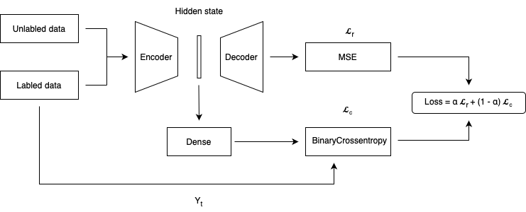

# A-Semi-Supervised-Approach-for-Handling-the-Challenges-of-Microbiome-Data

This project focuses on the semi-supervised classification of the human microbiome, leveraging advanced Big Data techniques to address the challenges posed by imbalanced datasets and a limited number of labeled samples. A semi-supervised autoencoder was designed as the core component of the model, enabling both feature extraction and representation learning in a latent space.

## Workflow

1. **Data Preprocessing**  
   Cleaning and normalization of microbiome tabular data, addressing missing values and anomalies to ensure data quality.

2. **Semi-Supervised Autoencoder**  
   Development of a custom semi-supervised autoencoder to learn meaningful latent representations of the microbiome. The autoencoder combines labeled and unlabeled data, maximizing the utility of the available dataset.

       
   *Figure 1: Semi-supervised autoencoder architecture used for feature extraction and representation learning.*

3. **Classification with Random Forest**  
   Integration of Random Forest as the classification algorithm, leveraging the encoded latent space features for improved classification accuracy.

4. **Evaluation and Visualization**  
   Assessment of model performance using metrics such as accuracy, precision, recall, and F1-score. Results were visualized using heatmaps and other graphical tools to highlight the effectiveness of the approach in distinguishing microbiome profiles.

## Key Results

This semi-supervised approach proved effective in:  
- Enhancing classification performance, even with limited labeled data.  
- Providing a scalable solution for analyzing human microbiome data in medical and research contexts.

The project demonstrates the potential of combining semi-supervised learning with Random Forest for solving complex problems in microbiome classification.

This is an extension of the work done by: dott.ssa Veronica Buttaro, [SAE-microbiome](https://github.com/VeronicaButtaro98/SAE-microbiome.git)
